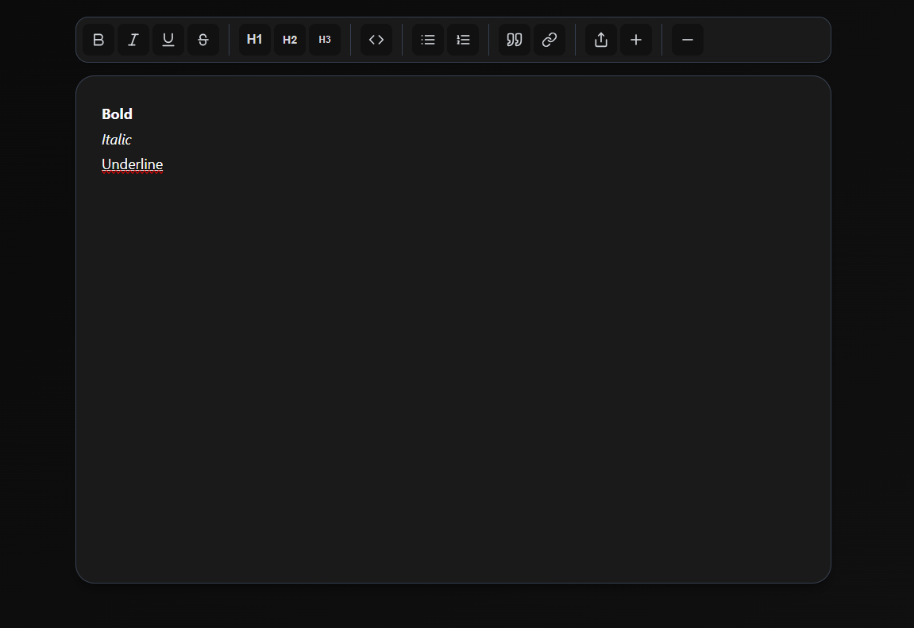

# Notes

<div align="center">



**A beautiful, minimalist notes app that lives in your browser**

[](https://codespaces.new/?repo=textarea)
[](https://vercel.com/new/clone?repository-url=https://github.com/xtrafr/notes)

</div>

---

## Features

- **Rich Text Editing** - Bold, italic, underline, headings, lists, and more
- **Share via URL** - Your notes are encoded in the URL hash
- **Auto-save** - Saves to localStorage as backup
- **Dark Mode** - Automatically adapts to your system preference
- **Works Offline** - Install as a PWA and use anywhere
- **Zero Dependencies** - Just pure HTML, CSS, and JavaScript
- **Beautiful UI** - Clean, modern design with smooth animations

## Quick Start

### Use it now
Open [index.html](./index.html) in your browser and start typing.

### Clone locally
```bash
git clone https://github.com/xtrafr/notes.git
cd textarea
open index.html
```

## Shortcuts

- `Ctrl/Cmd + B` - **Bold**
- `Ctrl/Cmd + I` - *Italic*
- `Ctrl/Cmd + U` - <u>Underline</u>
- `Ctrl/Cmd + K` - [Link](https://example.com)
- `Ctrl/Cmd + S` - Download as HTML file

## How it Works

Your note is automatically saved to the URL hash. This means:

- **Share notes** - Just copy the URL
- **Bookmark** - Save notes for later
- **No database** - Your data stays private
- **Works offline** - LocalStorage backup included

## Tech Stack

- **Frontend**: Vanilla HTML5, CSS3, JavaScript ES6+
- **Storage**: URL Hash + LocalStorage
- **PWA**: Service Worker + Web App Manifest
- **Deployment**: Static hosting (Vercel, Netlify, GitHub Pages)

## Project Structure

```
textarea/
├── index.html          # The entire app (single file!)
├── manifest.json       # PWA manifest
├── sw.js              # Service worker for offline support
├── favicon.ico        # Favicon
└── README.md          # This file
```

## Why Notes?

- **Privacy-first** - Your data never leaves your browser
- **Instant** - No loading time, no setup required
- **Portable** - Works on any device with a browser
- **Simple** - Focus on writing, not features

## License

MIT © [Xtra](https://github.com/xtrafr)

---

<div align="center">
Made with love by <a href="https://github.com/xtrafr">Xtra</a>
</div>
