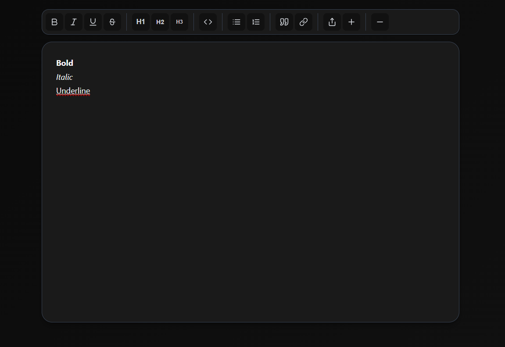

# Notes

<div align="center">



**A beautiful, minimalist notes app that lives in your browser**

[](https://codespaces.new/?repo=textarea)

</div>

---

## Features

- **Rich Text Editing** - Bold, italic, underline, headings, task checklists, and more
- **Share via URL** - Your notes are encoded directly in the URL hash
- **Multi-Note Library** - Instantly switch between unlimited saved notes
- **E2E Encryption** - Lock sensitive notes with AES-GCM passwords
- **Advanced Sharing** - Issue Read-Only links or self-destructing Timebombs
- **Works Offline** - Install natively as a PWA and use anywhere
- **Zero Dependencies** - Just pure vanilla HTML, CSS, and JS
- **Beautiful UI** - Minimalist, brutalist design with smooth animations

## Quick Start

### Use it now
Open [index.html](./index.html) in your browser and start typing.

### Clone locally
```bash
git clone https://github.com/xtrafr/notes.git
cd notes
open index.html
```

## Shortcuts

- `Ctrl/Cmd + B` - **Bold**
- `Ctrl/Cmd + I` - *Italic*
- `Ctrl/Cmd + U` - <u>Underline</u>
- `Ctrl/Cmd + K` - [Link](https://example.com)
- `Ctrl/Cmd + S` - Download as HTML file

Your primary data stays in a highly-optimized library inside your browser's local storage. On top of that, your note seamlessly syncs into the URL Hash using standard base64 compression. This means:

- **Library context** - The app tracks what note you are editing instantly
- **Share notes** - Just copy the URL to hand someone an active clone
- **No database** - Fast and completely private
- **Offline first** - PWA capability included

## Tech Stack

- **Frontend**: Vanilla HTML5, CSS3, JavaScript ES6+
- **Storage**: URL Hash + LocalStorage
- **PWA**: Service Worker + Web App Manifest
- **Deployment**: Static hosting (Vercel, Netlify, GitHub Pages)

## Project Structure

```
notes/
├── index.html         # HTML structure & Generic UI Modals
├── style.css          # Brutalist UI styling and tokens
├── app.js             # Core algorithms (Multi-note logic, E2EE, hashing)
├── manifest.json      # PWA manifest
├── sw.js              # Service worker for offline app install
└── README.md          # This file
```

## Why Notes?

- **Privacy-first** - Your data never leaves your browser
- **Instant** - No loading time, no setup required
- **Portable** - Works on any device with a browser
- **Simple** - Focus on writing, not features

## License

MIT © [Xtra](https://github.com/xtrafr)

---

<div align="center">
Made with love by <a href="https://github.com/xtrafr">Xtra</a>
</div>
